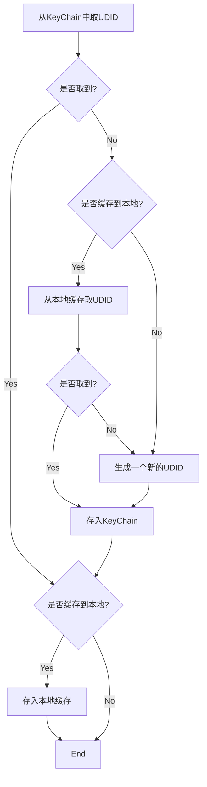

```mermaid
graph TD
A[从KeyChain中取UDID] --> B{是否取到?}
B -- Yes --> C{是否缓存到本地?}
C -- Yes --> D[存入本地缓存]
D --> E[End]
C -- No --> E
B -- No --> J{是否缓存到本地?}
J -- Yes --> F[从本地缓存取UDID]
J -- No --> H
F --> G{是否取到?}
G -- Yes --> I
H --> I[存入KeyChain]
G -- No --> H[生成一个新的UDID]
I --> C
```

[mermaid flowchart basic syntax](https://mermaid-js.github.io/mermaid/#/./flowchart?id=flowcharts-basic-syntax)
